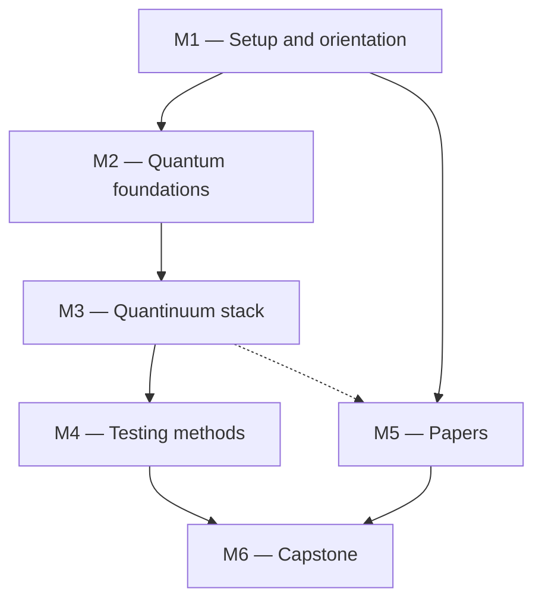
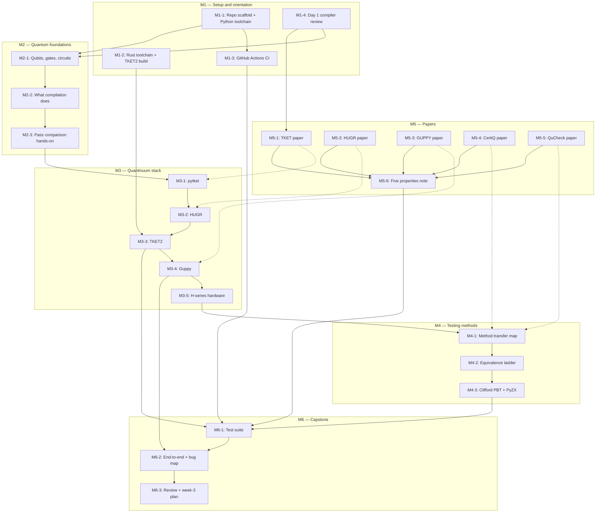

<!--
File: docs/GITHUB_PROJECT.md

Project plan for hyeyoungshin/quantum-primer.  This file is the populate
input consumed by scripts/python/gh_project_populate.py at bootstrap, and
is thereafter maintained by scripts/python/gh_project_render.py.

Manual prose (summary, milestone descriptions, exit criteria, mermaid
graphs) is hand-edited.  Issue listings between

    BEGIN GENERATED: milestone-N
    ...
    END GENERATED: milestone-N

markers are regenerated from GitHub state by gh_project_render.py; after
the first populate run, edits to those regions will be overwritten on the
next render.  Before the first populate run, the content inside the
markers IS the hand-authored issue plan.

Populate-input conventions (enforced by the parser in
gh_project_populate.py):

  - milestones: "### Milestone N — Title" headers; the "**Description:**"
    text must start on the line AFTER the marker; the
    "**Exit criterion:** ..." text is terminated by a "---" rule.
  - labels: "## Labels" entries of the form:  - `name` (hex6) — text
  - issues: "### Issue MN-k: Title" headers, each with a "**Labels:** ..."
    line (colon inside the bold; render normalizes this to "**Labels**:"
    on the first regeneration).
  - milestone descriptions and exit criteria must not contain "---" lines.
-->

# quantum-primer — GitHub Project Roadmap

**Project Title**: quantum-primer — Quantum compiler test engineer onboarding

**Repository**: `hyeyoungshin/quantum-primer`

**Date**: 2026-07-14

---

## Summary

A structured onboarding project for starting work as a quantum compiler test engineer, derived from the two-week study plan in `contents/quantinuum_onboarding.html`.  Six milestones: environment setup and compiler-lens orientation (M1), quantum computing foundations (M2), the Quantinuum compiler stack — pytket, HUGR, TKET2, Guppy, H-series hardware (M3), quantum compiler testing methods (M4), the five required papers (M5), and a capstone test suite with an end-to-end pipeline walkthrough (M6).

---

## Description

The source curriculum (`contents/quantinuum_onboarding.html`) is a 14-day study plan written for an engineer with a solid programming-languages and compiler-verification background but little or no quantum physics.  The goal is not to become a quantum physicist: it is to acquire exactly enough quantum knowledge to reason about *what a quantum compiler must preserve*, and then to build working familiarity with the full Quantinuum compiler stack and the testing methods that apply to it.

This project turns that curriculum into trackable GitHub issues.  Each study day maps to one or more issues; the five required papers form their own reading track (M5) that interleaves with the daily work.  Nearly every issue produces a concrete artifact committed to this repository, under one of three directories established in M1:

+ `notes/` — one markdown note per study day or paper, including answers to each day's "key question";
+ `exercises/` — small runnable Python programs (Bell state, pass comparison, Guppy programs, end-to-end pipeline);
+ `tests/` — the growing pytest + Hypothesis test suite, run by GitHub Actions CI on every push.

The CI workflow (M1-3) is itself part of the learning: a compiler test engineer's deliverable is an automated test suite, so this project treats "my exercises run green in CI" as the standing definition of done.  The capstone (M6) grows the suite into the five standard categories for quantum compiler testing — structural, predicate, equivalence, metric, and regression tests — and adds a scheduled deep property-testing run.

**The Quantinuum stack (orientation)**.  Guppy (Python-embedded DSL for hybrid quantum-classical programs) compiles to HUGR (the shared IR — "LLVM IR for quantum"), which is optimized and lowered by TKET2 (Rust); the mature pytket (TKET) toolchain remains the production circuit-level compiler; everything targets H-series trapped-ion hardware (H1, H2, Helios).

### Day-to-issue map

| Day | Focus | Issues |
|-----|-------|--------|
| 1 | Compiler review through a quantum lens | M1-4 (M1-1, M1-2, M1-3 alongside); start M5-1 |
| 2 | Quantum computing — the minimum you need | M2-1 |
| 3 | Circuit model and what compilation does | M2-2, M2-3 |
| 4 | TKET (pytket) | M3-1; finish M5-1 |
| 5 | HUGR | M3-2, M5-2 |
| 6 | TKET2 | M3-3 |
| 7 | Guppy | M3-4; start M5-3 |
| 8 | H-series hardware | M3-5 |
| 9 | Testing methods and strategy | M4-1, M5-4, M5-5 |
| 10 | Circuit equivalence and formal verification | M4-2, M4-3 |
| 11 | Building a test suite | M6-1 |
| 12 | Papers day — deep reading | finish M5-3, M5-5; M5-6 |
| 13 | End-to-end: Guppy → HUGR → hardware | M6-2 |
| 14 | Review, gaps, integration | M6-3 |

---

## Labels

- `milestone-1-setup` (0075ca) — Milestone 1: Setup and orientation.
- `milestone-2-quantum` (0075ca) — Milestone 2: Quantum computing foundations.
- `milestone-3-stack` (0075ca) — Milestone 3: The Quantinuum compiler stack.
- `milestone-4-testing` (5319e7) — Milestone 4: Quantum compiler testing methods.
- `milestone-5-papers` (5319e7) — Milestone 5: Papers — required reading.
- `milestone-6-capstone` (5319e7) — Milestone 6: Capstone — test suite and end-to-end pipeline.
- `review` (854f0b) — Classical compiler knowledge re-anchored to the quantum setting.
- `quantum-basics` (0f6e56) — Core quantum computing concepts.
- `tools` (1a4b8c) — TKET, TKET2, HUGR, Guppy, H-series hardware.
- `testing` (3c3489) — Testing methods and test development.
- `paper-reading` (a32d2d) — One of the five required papers.
- `hands-on` (0e8a16) — Produces runnable code committed to this repository.
- `writeup` (c5def5) — Produces a note under notes/.
- `ci` (ededed) — GitHub Actions and automation.

---

## Milestones

### Milestone 1 — Setup and orientation

**Description:**

Stand up everything needed to work through the curriculum: the repository layout (`notes/`, `exercises/`, `tests/`), a pinned Python environment with the quantum toolchain (pytket, guppylang, pyzx, pytest, hypothesis), a Rust toolchain with TKET2 building from source, and GitHub Actions CI running the exercise test suite on every push.  Day 1 of the study plan (compiler review through a quantum lens) also lands here: it needs no new tooling and anchors the vocabulary — semantic preservation, unitary equivalence, linearity — used by every later issue.

**Exit criterion:** A fresh clone plus the documented setup steps yields a passing `pytest` run locally and in CI; `cargo test` runs in the TKET2 clone; `notes/day01-semantic-preservation.md` is committed and answers the Day 1 key question.

---

### Milestone 2 — Quantum computing foundations

**Description:**

Days 2–3 of the study plan.  Just enough quantum mechanics to understand what the compiler is manipulating — qubit, gate, circuit, measurement, entanglement, each mapped to a compiler-flavored mental model — followed by the specific problems quantum compilation solves (gate synthesis, routing/placement, optimization, retargeting) and the NISQ constraints that make resource metrics correctness-adjacent: on noisy hardware, a pass that wastes gates produces programs that fail.

**Exit criterion:** The Bell-state and pass-comparison exercises are committed and green in CI; notes for Days 2 and 3 are committed, including answers to the key questions.

---

### Milestone 3 — The Quantinuum compiler stack

**Description:**

Days 4–8, one stack layer per issue: pytket (the mature production compiler), HUGR (the shared IR that TKET2 and Guppy both operate on), TKET2 (the next-generation Rust compiler), Guppy (the Python-embedded DSL with real control flow and linear types), and the H-series trapped-ion hardware everything targets.  Each issue records a "testing angle": what a test engineer must assert at that layer.

**Exit criterion:** Can build and transform circuits in pytket and explain its predicate system; can explain HUGR validation and why linear qubit edges cannot fork; can run TKET2's test suite and locate its rewrite-rule tests; can write, compile, and inspect a Guppy program with control flow; can enumerate the H-series constraints that matter for testing.  Notes for Days 4–8 committed.

---

### Milestone 4 — Quantum compiler testing methods

**Description:**

Days 9–10.  Map classical compiler-testing techniques (differential testing, property-based testing, regression corpora, equivalence checking) onto the quantum domain; understand what is genuinely new or harder — probabilistic outputs, exponential simulation cost, no intermediate observability, coverage that cannot be line coverage — and learn the equivalence-verification ladder from unitary comparison through statevector simulation, ZX-calculus, and SMT, up to hardware runs, with Clifford circuits as the efficiently verifiable testbed.

**Exit criterion:** The testing-strategy and equivalence-methods notes are committed; the Clifford-circuit equivalence property test is green in CI.

---

### Milestone 5 — Papers — required reading

**Description:**

The five required papers, one issue each, plus a synthesis deliverable.  Reading interleaves with M2–M4 as shown in the day-to-issue map: TKET (arXiv:2003.10611) frames everything and is started on Day 1; HUGR (arXiv:2510.11420) pairs with Day 5; GUPPY (arXiv:2510.12582) pairs with Days 7 and 12; CertiQ (arXiv:1908.08963) and QuCheck (arXiv:2503.22641) pair with Day 9.  The synthesis note — "Five properties I plan to add to the TKET2/Guppy test suite" — is the first deliverable to share with the team lead.

**Exit criterion:** Five paper notes committed (a two-sentence summary plus roughly one page each); the "five properties" synthesis note is committed and ready to share.

---

### Milestone 6 — Capstone — test suite and end-to-end pipeline

**Description:**

Days 11, 13, and 14.  Build a small but real test suite covering the five standard categories (structural, predicate, equivalence, metric, regression) for at least one pytket pass and one HUGR/TKET2 pass, wired into CI with a scheduled deep property-testing run; walk the full pipeline from Guppy source through HUGR and TKET2 passes to emulated execution, producing a bug-surface map of where defects can hide at each layer; then close with a self-assessment against the curriculum checklist and a concrete week-3 plan, including a real TKET2 issue picked to reproduce as a test.

**Exit criterion:** Test suite green in CI including the scheduled deep run; end-to-end exercise and bug-surface note committed; self-assessment checklist complete with evidence links; week-3 plan drafted.

---

### Milestone dependencies

M1 gates everything.  The papers track (M5) starts immediately after setup and runs alongside M2–M4; papers 2 and 3 pair naturally with the stack milestone (M3).  The capstone (M6) consumes the stack knowledge, the testing methods, and the papers synthesis.



---

## Issues

Each issue below is tagged with its milestone label (`milestone-N-*`, which the render script uses to group issues) plus topic labels mirroring the curriculum's day tags.  Issue titles are created on GitHub with a `[MN-k]` prefix for cross-referencing and ordering.  Most issues end with the day's "key question" — answer it in the day's note before closing the issue.

---

## Milestone 1 — Setup and orientation

<!-- BEGIN GENERATED: milestone-1 -->

### Issue M1-1: Scaffold the repository and set up the Python quantum toolchain

**Labels:** `milestone-1-setup`, `hands-on`

## Description

Establish the repository layout and a reproducible Python environment carrying every package the curriculum needs.  All later hands-on issues assume this structure exists.

## Tasks

- [ ] Create the working directories: `notes/` (one markdown note per study day or paper), `exercises/` (runnable example programs), `tests/` (the pytest suite).
- [ ] Add a pinned `requirements.txt` (or `pyproject.toml`) covering: `pytket`, `pytket-quantinuum` (emulator access), `guppylang`, `pyzx`, `pytest`, `hypothesis`.
- [ ] Document the setup in the top-level `README.md`: create a virtual environment, install, run `pytest`.
- [ ] Add a `.gitignore` for Python (venv, `__pycache__`, `.hypothesis/`).
- [ ] Add a smoke test `tests/test_environment.py` that imports each package and builds a trivial one-qubit pytket circuit, so environment breakage is caught by CI rather than mid-exercise.

## Acceptance criteria

- [ ] On a fresh clone, the documented steps produce an environment where `pytest` passes.
- [ ] All packages import cleanly; the smoke test exercises a minimal pytket circuit build.

---

### Issue M1-2: Set up the Rust toolchain and build TKET2 from source

**Labels:** `milestone-1-setup`, `tools`, `hands-on`

## Description

TKET2 is a Rust workspace; Day 6 studies it and the capstone tests against it, so get the build working early while there is slack for toolchain problems.  This issue is about the build, not yet about understanding the code.

## Tasks

- [ ] Install a Rust toolchain via `rustup` (record the version used in the note).
- [ ] Clone the TKET2 repository: `git clone https://github.com/CQCL/tket2` (outside this repo; record the commit hash).
- [ ] Build and run the test suite: `cargo test`.  Note the wall-clock time and any failures.
- [ ] Skim the workspace layout: the `tket2` crate, the Python bindings (`tket2-py`), and the `hugr` / `hugr-passes` dependencies.
- [ ] Record versions, commit hash, and first impressions of the test layout in `notes/setup-tket2.md`.

## Acceptance criteria

- [ ] `cargo test` completes in the TKET2 clone (document any failing tests rather than hiding them).
- [ ] `notes/setup-tket2.md` committed with toolchain versions and workspace-layout notes.

---

### Issue M1-3: Add GitHub Actions CI for the exercise test suite

**Labels:** `milestone-1-setup`, `ci`, `hands-on`

## Description

A compiler test engineer's product is an automated test suite, so this project's exercises should run automatically from the start.  Add a workflow that runs `pytest` on every push and pull request.

## Tasks

- [ ] Add `.github/workflows/ci.yml`: check out, set up Python (e.g. `actions/setup-python@v5` with pip caching), install `requirements.txt`, run `pytest`.
- [ ] Trigger on pushes to `main` and on pull requests.
- [ ] Add a CI status badge to `README.md`.
- [ ] Optional: add a `project-plan` job that runs `python3 scripts/python/gh_project_render.py docs/GITHUB_PROJECT.md --repo hyeyoungshin/quantum-primer --check --no-env-prefix` to flag when this file is stale relative to GitHub state.  (Note: `--no-env-prefix` is required on runners, where `GITHUB_TOKEN` is how `gh` authenticates.)

## Acceptance criteria

- [ ] CI runs green on `main` and triggers on every pull request.
- [ ] README shows the CI badge.

---

### Issue M1-4: Day 1 — compiler review through a quantum lens

**Labels:** `milestone-1-setup`, `review`, `writeup`

## Description

Re-anchor existing compiler knowledge to the vocabulary used throughout this curriculum, and identify where quantum compilation is similar to classical compilation and where it fundamentally differs:

+ **No-cloning** — a qubit cannot be copied; types must be *linear* (consumed exactly once).  A hard constraint the compiler must never violate.
+ **No arbitrary reads** — a qubit cannot be observed mid-computation without destroying its state; measurement is destructive and probabilistic.
+ **Reversibility** — most gates are unitary (reversible); measurement and reset are the special non-reversible cases.
+ **Correctness = unitary equivalence** — a pass is correct if the output circuit implements the same unitary matrix, up to global phase.  This is the quantum analogue of semantic preservation.
+ **Exponential state space** — an n-qubit system has 2ⁿ basis states; verification must use structural and algebraic reasoning, not exhaustive testing.

## Tasks

- [ ] Read the abstract and correctness discussion of the TKET paper ([arXiv:2003.10611](https://arxiv.org/abs/2003.10611)) to ground the above in practice (full read tracked in M5-1).
- [ ] Write `notes/day01-semantic-preservation.md`: a one-paragraph answer to *"What is semantic preservation in a quantum compiler?"* plus a table mapping each difference above to its closest classical-compilation analogue.

## Acceptance criteria

- [ ] `notes/day01-semantic-preservation.md` committed.
- [ ] The note answers the key question below.

> **Key question (answer before Day 2).** If a compiler pass changes the order of two gates, how would you check whether the result is still correct?

<!-- END GENERATED: milestone-1 -->

---

## Milestone 2 — Quantum computing foundations

<!-- BEGIN GENERATED: milestone-2 -->

### Issue M2-1: Day 2 — qubits, gates, circuits, measurement: the minimum you need

**Labels:** `milestone-2-quantum`, `quantum-basics`, `hands-on`, `writeup`

## Description

Learn just enough quantum mechanics to understand what the compiler is manipulating, in compiler terms:

+ **Qubit** — a value in a 2D complex vector space (|0⟩, |1⟩, or a superposition α|0⟩ + β|1⟩); a typed variable with a very constrained operation set.
+ **Gate** — a unitary matrix applied to one or more qubits.  Single-qubit: X, H, Z, Rz(θ).  Two-qubit: CNOT, CZ.  These are the instructions of the quantum ISA.
+ **Circuit** — a sequence of gates on a register of qubits; the analogue of a straight-line program or basic block.
+ **Measurement** — projects a qubit to |0⟩ or |1⟩ probabilistically, returning a classical bit; destroys superposition; side-effectful, so the compiler must not reorder measurements carelessly.
+ **Entanglement** — a multi-qubit state that is not a product of per-qubit states; CNOT creates it; it affects which optimizations are valid.

You do not need deep familiarity with Dirac bra-ket notation: read |ψ⟩ as "some quantum state" and U as "some transformation" — the compiler manipulates programs, not physics.

## Tasks

- [ ] Read the "Quantum gates" and "Quantum circuits" sections of [Quantum Computing for the Very Curious](https://quantum.country/qcvc) (~1.5 hrs), or unit 1 of IBM Quantum Learning's "Basics of Quantum Information".
- [ ] Write `exercises/bell.py`: build the Bell-state circuit (2 qubits, H + CNOT) with pytket and print it.  This is the "hello world" of quantum circuits and recurs constantly.
- [ ] Add a small test asserting the Bell circuit has the expected gate counts and qubit count.
- [ ] Write `notes/day02-quantum-minimum.md`: the five concepts above in your own words.

## Acceptance criteria

- [ ] `exercises/bell.py` and its test are committed and green in CI.
- [ ] `notes/day02-quantum-minimum.md` committed.

---

### Issue M2-2: Day 3 — the circuit model and what compilation does

**Labels:** `milestone-2-quantum`, `quantum-basics`, `writeup`

## Description

Understand the specific problems a quantum compiler solves — these map directly to the passes a test engineer validates:

+ **Gate synthesis** — express a desired unitary using a finite target gateset (e.g. hardware supports only {Rz, SX, CNOT}).
+ **Routing / placement** — physical qubits have limited connectivity; insert SWAPs to bring interacting qubits together.
+ **Optimization** — reduce gate count and depth (fewer gates = less decoherence = more accurate results): cancel adjacent inverses (X·X = I), peephole rewrites, commutation rules.
+ **Retargeting** — compile the same logical circuit to different hardware backends; TKET's central value proposition.

NISQ (Noisy Intermediate-Scale Quantum) constraints make this concrete: gates have error rates and long circuits fail, so the compiler must genuinely minimize resource usage — correctness is necessary but not sufficient, and tests must check both semantic preservation *and* that passes actually reduce gate counts.

## Tasks

- [ ] Write `notes/day03-compilation-problems.md` mapping each problem above to its closest classical analogue (instruction selection, register allocation/spilling, peephole optimization, backend retargeting) and noting where the analogy breaks down.
- [ ] In the same note, answer: *why is gate count a correctness-adjacent metric on NISQ hardware?*

## Acceptance criteria

- [ ] `notes/day03-compilation-problems.md` committed, covering all four compilation problems and the NISQ question.

---

### Issue M2-3: Day 3 hands-on — apply pytket passes and measure gate-count reduction

**Labels:** `milestone-2-quantum`, `hands-on`

## Description

First contact with real compilation passes: apply pytket passes to circuits and observe what they do to gate counts and depth.

## Tasks

- [ ] Write `exercises/pass_comparison.py`: build a few sample circuits, apply `DecomposeBoxes` and `FullPeepholeOptimise`, and print gate counts and depth before and after each pass.
- [ ] Read the [pytket compilation passes reference](https://docs.quantinuum.com/tket/api-docs/passes.html) for the passes you used.
- [ ] Add `tests/test_pass_reduction.py` asserting that `FullPeepholeOptimise` reduces (or at least does not increase) the gate count of a known redundant circuit.

## Acceptance criteria

- [ ] `exercises/pass_comparison.py` committed and runnable.
- [ ] `tests/test_pass_reduction.py` green in CI.

<!-- END GENERATED: milestone-2 -->

---

## Milestone 3 — The Quantinuum compiler stack

<!-- BEGIN GENERATED: milestone-3 -->

### Issue M3-1: Day 4 — TKET (pytket), the production compiler

**Labels:** `milestone-3-stack`, `tools`, `hands-on`, `writeup`

## Description

Develop working familiarity with pytket — the mature, Python-facing compiler you will interact with daily.  The five-minute architecture mental model:

+ Circuits are DAGs: nodes are gates, edges are qubit/bit wires.
+ Passes are transformations `Circuit → Circuit`, composable via `SequencePass` and `RepeatPass`.
+ A `BackendInfo` object describes hardware constraints (gateset, topology, fidelities).
+ A backend takes a compiled circuit and runs it — on H-series hardware or a simulator.
+ **Predicates are invariants**: passes have preconditions and postconditions.  This maps directly onto a PL/verification background.

Key passes to know: `DecomposeBoxes` (expand abstract boxes to primitives), `FullPeepholeOptimise` (local cancellation and rewrites), `CXMappingPass` (routing for connectivity), `KAKDecomposition` (optimal two-qubit synthesis), and the `Rebase*` family (retarget to specific gatesets).

Note: pytket (Python over a C++ core) is the *current production* tool; TKET2 (Rust) is the next-generation rewrite.  A test engineer here works with both.

## Tasks

- [ ] Read the Circuits, Passes, and Predicates sections of the [pytket user guide](https://docs.quantinuum.com/tket/user-guide/).
- [ ] Write `tests/test_pytket_passes.py`: apply `FullPeepholeOptimise` to a sample circuit and assert (1) the gate count decreased and (2) the circuit still satisfies its predicates / `circuit.is_valid()`.
- [ ] Write `notes/day04-pytket.md` summarizing the pass/predicate architecture and listing the pre/postconditions of two passes you inspected.

## Acceptance criteria

- [ ] `tests/test_pytket_passes.py` green in CI.
- [ ] `notes/day04-pytket.md` committed.

---

### Issue M3-2: Day 5 — HUGR, the shared intermediate representation

**Labels:** `milestone-3-stack`, `tools`, `writeup`

## Description

HUGR (Hierarchical Unified Graph Representation) is the central IR of the new Quantinuum stack — what TKET2 and Guppy both operate on, and the primary artifact a test engineer validates.  HUGR in five points:

+ **A directed hierarchical graph** — nodes are operations, edges are typed values (qubits, classical data); like MLIR, but designed for quantum-classical programs.
+ **Linear types enforced structurally** — qubit edges cannot fork (no cloning); the graph structure makes illegal programs unrepresentable, a property tests can assert.
+ **Extensible via ops** — new operation types can be added (like MLIR dialects), supporting lowering through abstraction levels.
+ **Machine-friendly** — pattern matching over the graph enables rewrite rules; most optimization passes are graph rewrites.
+ **Shared across tools** — Guppy compiles to HUGR; TKET2 optimizes HUGR; the H-series backend consumes lowered HUGR.

**Testing angle**: HUGR has a validation step, and a well-formed HUGR must pass it.  Tests should always assert *after any pass, the resulting HUGR is valid* — the quantum equivalent of checking a CFG is well-formed after a transformation.

## Tasks

- [ ] Read the Introduction and Section 2 (design goals) of the HUGR paper ([arXiv:2510.11420](https://arxiv.org/abs/2510.11420)); skip the formal type theory on the first pass (full read tracked in M5-2).
- [ ] Skim the [HUGR GitHub repo and spec](https://github.com/CQCL/hugr) and the [hugr Rust crate docs](https://docs.rs/hugr).
- [ ] Write `notes/day05-hugr.md`: the graph structure, the validation guarantees, and an explanation in your own words of why linear qubit edges cannot fork.

## Acceptance criteria

- [ ] `notes/day05-hugr.md` committed, including the testing-angle paragraph.

---

### Issue M3-3: Day 6 — TKET2, the next-generation Rust compiler

**Labels:** `milestone-3-stack`, `tools`, `hands-on`, `writeup`

## Description

Understand how TKET2 differs from TKET and how to work with it in Rust and Python:

+ **IR** — TKET uses a DAG circuit representation; TKET2 uses HUGR, which is far more expressive and handles control flow beyond linear circuits.
+ **Language** — TKET's core is C++; TKET2 is Rust with Python bindings: better memory safety, better test tooling.
+ **Passes** — in TKET2, passes are `Hugr → Hugr` functions, often implemented as rewrite rules via the `hugr-passes` crate; composable and testable.
+ **Status** — TKET2 is under active development; pytket remains the production-stable tool.

## Tasks

- [ ] In the TKET2 clone from M1-2, re-run `cargo test` and this time study *what* is being tested and *how* (unit tests vs. `proptest` property tests).
- [ ] Read the `tket2-py` README to understand the Python bindings.
- [ ] Study the `hugr-passes` crate: how are rewrite rules defined?  How are they tested?
- [ ] Write `notes/day06-tket2.md`: how rewrite rules are defined and tested, plus one candidate rewrite rule to target with a property test in the capstone (M6-1).
- [ ] Resources: [TKET2 GitHub](https://github.com/CQCL/tket2), [TKET2 Rust docs](https://docs.rs/tket2).

## Acceptance criteria

- [ ] `notes/day06-tket2.md` committed, naming a concrete rewrite rule and its existing test coverage.

---

### Issue M3-4: Day 7 — Guppy, the high-level language

**Labels:** `milestone-3-stack`, `tools`, `hands-on`, `writeup`

## Description

Guppy is a Python-embedded DSL for *hybrid quantum-classical programs* — not just circuits:

+ Real control flow: loops, recursion, if/else branching on measurement results — a significant leap beyond what pytket circuits can express.
+ Statically typed: Guppy code is *parsed and compiled*, not traced, so type errors are caught at compile time.
+ Linear types: qubits must be used exactly once; the type checker enforces this.
+ Compiles to HUGR, which TKET2 passes then optimize.

```python
from guppylang import guppy
from guppylang.std.qsystem import qubit, measure, h, cx

@guppy
def bell_state() -> bool:
    q1, q2 = qubit(), qubit()
    h(q1)
    cx(q1, q2)
    return measure(q1) == measure(q2)  # always True
```

**Testing angle**: Guppy adds a *compiler frontend* to test, not just passes — type errors, linearity violations, and control-flow bugs can all appear here.

## Tasks

- [ ] Work through the [Guppy docs and tutorial](https://docs.quantinuum.com/guppy/) (`guppylang` is already installed via M1-1).
- [ ] Write `exercises/guppy_loop.py`: a Guppy program that uses a loop; compile it and inspect the resulting HUGR (validate it, count operations, check types).
- [ ] Run a Guppy program on the emulator (`guppy.emulator()`) and check the output.
- [ ] Read the [Guppy migration guide](https://docs.quantinuum.com/guppy/migration_guide.html) to understand the pytket → Guppy differences.
- [ ] Write `notes/day07-guppy.md`: what the frontend guarantees (and therefore what frontend tests must probe).

## Acceptance criteria

- [ ] `exercises/guppy_loop.py` committed and runnable.
- [ ] `notes/day07-guppy.md` committed.

---

### Issue M3-5: Day 8 — Quantinuum H-series hardware: what you are compiling for

**Labels:** `milestone-3-stack`, `tools`, `quantum-basics`, `writeup`

## Description

Understand the target hardware well enough to know which compilation constraints are real and what constitutes a hardware-violating bug:

+ **Technology** — qubits are Ytterbium ions in electromagnetic traps; much higher fidelity than superconducting qubits, and **all-to-all connectivity**, so there is no routing problem of the kind superconducting devices have.
+ **Native gateset** — single-qubit rotations (Rz, Ry, …) plus a native two-qubit ZZ interaction (MS gate); the compiler must target this gateset.
+ **Key constraint** — two-qubit gate count dominates the error budget; tests should verify that optimization passes genuinely reduce 2Q gate count.
+ **Helios** — the newest, most powerful system and the near-term target for Guppy programs.
+ **QIR & qsystem** — programs are ultimately lowered to instructions the hardware control stack accepts.

Why this matters for testing: a pass that wastes 2Q gates has real consequences (programs fail on hardware); some passes are only valid for specific hardware models, so tests must be parametrized by target backend; and the emulator (`pytket-quantinuum`) enables testing without hardware access — know its limitations.

## Tasks

- [ ] Read the [Quantinuum systems documentation](https://docs.quantinuum.com/systems/) and the H2 product data sheet.
- [ ] Write `notes/day08-hardware.md`, including a list titled "what constitutes a hardware-violating bug" (e.g. emitting a gate outside the native gateset, inflating 2Q gate count, assuming connectivity constraints that do not exist on trapped-ion hardware).

## Acceptance criteria

- [ ] `notes/day08-hardware.md` committed with the hardware-violating-bug list.

<!-- END GENERATED: milestone-3 -->

---

## Milestone 4 — Quantum compiler testing methods

<!-- BEGIN GENERATED: milestone-4 -->

### Issue M4-1: Day 9 — map classical compiler-testing methods to the quantum domain

**Labels:** `milestone-4-testing`, `testing`, `writeup`

## Description

Identify which existing testing skills transfer directly, which need adaptation, and which are new.

**Transfers from classical compiler testing:**

+ **Differential testing** — run the same circuit through multiple compilation paths and compare outputs (statistically, since results are probabilistic).  The most powerful tool available.
+ **Property-based testing** — generate random circuits, apply a pass, assert invariants: gate count decreased, HUGR is valid, qubit count unchanged, pass predicates satisfied.
+ **Regression testing** — keep a corpus of circuits that previously triggered bugs.
+ **Equivalence checking** — for small circuits (≤ ~15 qubits), compute the full unitary and compare (`circuit.get_unitary()` in pytket, or `quimb`).

**New or harder in quantum:**

+ **Probabilistic outputs** — no exact output equality; use statistical tests (chi-squared, KL divergence) or unitary equivalence.
+ **Exponential simulation cost** — unitary comparison scales as O(4ⁿ); restrict to small circuits in automated tests.
+ **No intermediate observability** — qubit state cannot be inspected mid-circuit; design tests around inputs and final measurements.
+ **Coverage is hard to define** — line coverage does not apply; think pass coverage (did every rewrite rule fire?) and circuit-pattern coverage (diverse topologies and gatesets).

**Practical test structure:** (1) generate or load a circuit; (2) apply a pass or sequence; (3) assert structural validity, predicates, resource metrics, and — for small circuits — unitary equivalence; (4) for regressions, assert known-good output.

## Tasks

- [ ] Read Papers 4 (CertiQ) and 5 (QuCheck) today — tracked as M5-4 and M5-5; they directly address the challenges above.
- [ ] Write `notes/day09-testing-strategy.md`: the transfer map (transfers / adapts / new), the practical test structure, and the toolbox (`pytest` + `hypothesis`, `proptest` for Rust, `circuit.get_unitary()`, statevector simulation).

## Acceptance criteria

- [ ] `notes/day09-testing-strategy.md` committed.

---

### Issue M4-2: Day 10 — circuit equivalence and formal verification approaches

**Labels:** `milestone-4-testing`, `testing`, `writeup`

## Description

Learn the verification ladder, ordered by cost, and when to apply each rung:

+ **Unitary matrix comparison** — compute both circuits' 2ⁿ×2ⁿ unitaries and compare elementwise; exact, but memory-bound around ~15 qubits.
+ **Statevector simulation** — simulate on fixed inputs and compare output distributions; faster, input-specific; good for regression tests.
+ **ZX-calculus** — a graphical rewriting system that can verify equivalence algebraically without computing unitaries; tooling: PyZX.
+ **SMT solvers** — encode equivalence as a decision problem; polynomial for Clifford circuits, hard in general (see the CertiQ paper, M5-4).
+ **Hardware runs** — statistical comparison of measurement distributions; the gold standard, but expensive; final validation only.

**Clifford circuits — the special case to exploit**: circuits built from H, S, and CNOT are classically simulable in polynomial time, so they can be verified exactly and efficiently.  Use them heavily in unit tests for passes.

## Tasks

- [ ] Write `notes/day10-equivalence-methods.md` with a when-to-use-which table over the five methods (cost, exactness, scale limit, typical use).
- [ ] Include a short section on why Clifford circuits are the ideal automated-test substrate.

## Acceptance criteria

- [ ] `notes/day10-equivalence-methods.md` committed with the comparison table.

---

### Issue M4-3: Day 10 hands-on — Clifford equivalence property test and PyZX

**Labels:** `milestone-4-testing`, `testing`, `hands-on`

## Description

Put Day 10's theory into executable form: a property-based test that optimization preserves the unitary of random Clifford circuits, plus a first contact with ZX-calculus tooling.

## Tasks

- [ ] Write a Hypothesis strategy that generates random Clifford circuits (gates drawn from {H, S, CNOT}) of bounded width and depth.
- [ ] Write `tests/test_clifford_equivalence.py`: generate a random Clifford circuit, apply `FullPeepholeOptimise`, and assert unitary equivalence via `circuit.get_unitary()` — remember equivalence is *up to global phase*.
- [ ] Convert a pytket circuit to ZX form with PyZX (installed via M1-1) and visualize it; save the example under `exercises/zx_example.py`.

## Acceptance criteria

- [ ] `tests/test_clifford_equivalence.py` green in CI.
- [ ] `exercises/zx_example.py` committed.

<!-- END GENERATED: milestone-4 -->

---

## Milestone 5 — Papers — required reading

<!-- BEGIN GENERATED: milestone-5 -->

### Issue M5-1: Paper 1 — t|ket⟩: a Retargetable Compiler for NISQ Devices

**Labels:** `milestone-5-papers`, `paper-reading`, `writeup`

## Description

Sivarajah et al., Quantum Science and Technology 2020, [arXiv:2003.10611](https://arxiv.org/abs/2003.10611).  **Core.**  The foundational TKET paper: design philosophy, pass architecture, benchmarks.  Read this first — it frames everything else.  Start on Day 1 (abstract and correctness discussion, per M1-4) and finish alongside Day 4 (M3-1).

## Tasks

- [ ] Read the paper, focusing on sections 2–4.
- [ ] Write `notes/paper1-tket.md`: a two-sentence summary plus roughly one page on the pass architecture and what "correct compilation" means in the authors' framing.

## Acceptance criteria

- [ ] `notes/paper1-tket.md` committed.

---

### Issue M5-2: Paper 2 — HUGR: a Quantum-Classical Intermediate Representation

**Labels:** `milestone-5-papers`, `paper-reading`, `writeup`

## Description

Koch, Borgna, Sivarajah et al., Quantinuum, PLanQC 2025, [arXiv:2510.11420](https://arxiv.org/abs/2510.11420).  **Core.**  The design spec for the IR you will be testing against — the closest thing to an internal spec doc.  Pair with Day 5 (M3-2): intro and design goals first, the formal type system on the second pass.

## Tasks

- [ ] Read the paper in full (two passes recommended: skip the formal type theory first, return to it after Day 7).
- [ ] Write `notes/paper2-hugr.md`: a two-sentence summary plus roughly one page on the type system, graph structure, and safety guarantees — and which of those guarantees a test suite can check mechanically.

## Acceptance criteria

- [ ] `notes/paper2-hugr.md` committed.

---

### Issue M5-3: Paper 3 — GUPPY: Pythonic Quantum-Classical Programming

**Labels:** `milestone-5-papers`, `paper-reading`, `writeup`

## Description

Koch, Lawrence, Singhal, Sivarajah, Duncan, Quantinuum, PLanQC 2025, [arXiv:2510.12582](https://arxiv.org/abs/2510.12582).  **Core.**  Explains Guppy's design — static typing, linearity, control flow, compilation to HUGR — and is written by the team you are joining.  Start alongside Day 7 (M3-4); finish on Day 12.

## Tasks

- [ ] Read the paper, focusing on Section 3 (language semantics) and Section 4 (comparison with other approaches).
- [ ] In `notes/paper3-guppy.md`, answer specifically: *why does static compilation (rather than tracing) matter for testing?*  and *what does linearity checking guarantee?* — plus the two-sentence summary.

## Acceptance criteria

- [ ] `notes/paper3-guppy.md` committed, answering both focus questions.

---

### Issue M5-4: Paper 4 — CertiQ: Mostly-automated Verification of a Realistic Quantum Compiler

**Labels:** `milestone-5-papers`, `paper-reading`, `writeup`

## Description

Shi et al., [arXiv:1908.08963](https://arxiv.org/abs/1908.08963).  **Methods.**  Shows how SMT solvers can verify quantum compiler passes for Qiskit; the approach transfers directly.  Read on Day 9 alongside M4-1.

## Tasks

- [ ] Read the paper, paying close attention to how unitary equivalence is encoded as an SMT problem and to the limitations the authors hit.
- [ ] Write `notes/paper4-certiq.md`: two-sentence summary, the SMT encoding sketch, and a frank list of where the approach stopped scaling.

## Acceptance criteria

- [ ] `notes/paper4-certiq.md` committed.

---

### Issue M5-5: Paper 5 — QuCheck: a Property-based Testing Framework for Quantum Programs

**Labels:** `milestone-5-papers`, `paper-reading`, `writeup`

## Description

[arXiv:2503.22641](https://arxiv.org/abs/2503.22641), 2025.  **Methods.**  The most directly actionable paper for day-to-day work: what properties to specify for quantum programs, how to generate inputs, how to handle probabilistic outputs.  Read on Day 9 alongside M4-1; revisit on Day 12.

## Tasks

- [ ] Read the paper, focusing on Section 3 (property-based testing methodology) and the case studies.
- [ ] Write `notes/paper5-qucheck.md`: two-sentence summary, the properties they tested, and — most importantly — which of those properties transfer to TKET/TKET2.

## Acceptance criteria

- [ ] `notes/paper5-qucheck.md` committed with the transferability analysis.

---

### Issue M5-6: Synthesis — "Five properties I plan to add to the TKET2/Guppy test suite"

**Labels:** `milestone-5-papers`, `paper-reading`, `writeup`

## Description

The Day 12 output and the first deliverable to share with the team lead: a short note distilling all five papers into five concrete, implementable test properties for the TKET2/Guppy stack.  Each property should name the layer it targets (Guppy frontend, HUGR validation, TKET2 pass, backend lowering), the generator it needs, and the oracle it uses (unitary equivalence, validation, predicates, statistics).

## Tasks

- [ ] Reread notes from M5-1 through M5-5.
- [ ] Write `notes/five-properties.md` (~1 page): five properties, each with target layer, input generator, and oracle.
- [ ] Mark which ones the capstone test suite (M6-1) will actually implement.

## Acceptance criteria

- [ ] `notes/five-properties.md` committed and ready to share with a team lead.
- [ ] At least two of the five properties are scoped for implementation in M6-1.

<!-- END GENERATED: milestone-5 -->

---

## Milestone 6 — Capstone — test suite and end-to-end pipeline

<!-- BEGIN GENERATED: milestone-6 -->

### Issue M6-1: Day 11 — build the test suite

**Labels:** `milestone-6-capstone`, `testing`, `hands-on`, `ci`

## Description

Build a small but real test suite covering the core properties of at least one pytket pass and one HUGR/TKET2 pass, structured in the five standard categories:

1. **Structural** — after every pass, assert `circuit.is_valid()` (pytket) or HUGR validation passes.
2. **Predicate** — assert pass postconditions (e.g. after a rebase pass, all gates lie in the target gateset).
3. **Equivalence** — property-based with Hypothesis: random Clifford circuits, apply pass, assert the unitary is unchanged (extends M4-3).
4. **Metric** — assert optimization passes actually reduce gate count on a set of benchmark circuits.
5. **Regression** — adopt circuits from bug reports in the TKET2 issue tracker as regression cases.

Circuit generation: `pytket.utils.gen_term_sequence_circuit` for parameterized circuits, custom Hypothesis strategies, and the existing TKET2 `proptest` strategies for inspiration.

## Tasks

- [ ] Organize `tests/` into the five categories (module per category or markers).
- [ ] Implement at least the two properties scoped in M5-6.
- [ ] Add at least one regression circuit sourced from the TKET2 issue tracker, with a comment linking the originating issue.
- [ ] Mark slow property tests (e.g. `@pytest.mark.slow`) and exclude them from the per-push CI job.
- [ ] Add a scheduled GitHub Actions workflow (e.g. weekly `schedule:` cron) that runs the full suite with a raised Hypothesis example budget (`--hypothesis-profile=deep`).

## Acceptance criteria

- [ ] All five categories present and green in CI.
- [ ] The scheduled deep run exists and has completed at least once.

---

### Issue M6-2: Day 13 — end-to-end: Guppy → HUGR → emulator, with a bug-surface map

**Labels:** `milestone-6-capstone`, `tools`, `testing`, `hands-on`, `writeup`

## Description

Run a full compilation pipeline from Guppy source to emulated execution and identify every layer where a bug could hide.

**Pipeline walkthrough:** (1) write a simple Guppy program — teleportation circuit or GHZ state; (2) compile it (`main.compile()`) to a HUGR; (3) inspect the HUGR — validate, count gates, check types; (4) optionally apply TKET2 passes; (5) run on the emulator (`guppy.emulator()`); (6) check the output distribution against expectation.

**Bug-surface map to produce:**

+ **Guppy frontend** — type checker misses a linearity violation; incorrect HUGR generated from valid source.
+ **HUGR passes** — a rewrite rule fires incorrectly; HUGR becomes structurally invalid; unitary not preserved.
+ **Backend lowering** — HUGR → hardware-instruction conversion introduces errors; incorrect gateset conversion.
+ **Emulator** — emulator bugs (less a compiler tester's concern, but important to distinguish from compiler bugs).

## Tasks

- [ ] Write `exercises/e2e_ghz.py` implementing the six-step pipeline above.
- [ ] Add a test asserting the emulated output distribution matches expectation (statistically — e.g. only the two GHZ outcomes appear, within tolerance).
- [ ] Write `notes/day13-bug-surface.md`: the bug-surface map, with one plausible concrete bug example per layer and the test type that would catch it.

## Acceptance criteria

- [ ] `exercises/e2e_ghz.py` and its test green in CI.
- [ ] `notes/day13-bug-surface.md` committed.

---

### Issue M6-3: Day 14 — review, self-assessment, and the week-3 plan

**Labels:** `milestone-6-capstone`, `testing`, `writeup`

## Description

Consolidate what was learned, identify remaining gaps, and set up for productive work in week 3 and beyond.

## Tasks

- [ ] Complete the self-assessment checklist in `notes/day14-review.md`, linking evidence (a note, an exercise, or a test) for each item:
  - [ ] Can explain what makes a quantum compilation pass correct.
  - [ ] Can build a pytket circuit and apply compilation passes.
  - [ ] Can write a Guppy program and compile it to HUGR.
  - [ ] Can inspect and validate a HUGR.
  - [ ] Can write property-based tests for a pytket pass using Hypothesis.
  - [ ] Can verify unitary equivalence for small circuits.
  - [ ] Have read all five papers and can summarize each in two sentences.
- [ ] For any unchecked item, write down the gap and the issue/resource that closes it.
- [ ] Draft the week-3 plan in the same note: pick one open TKET2 issue to reproduce as a test; note whether to read a ZX-calculus paper for deeper equivalence tooling; if possible, plan to shadow a hardware calibration run for context on why gate counts matter.

## Acceptance criteria

- [ ] `notes/day14-review.md` committed with the checklist, evidence links, and the week-3 plan.
- [ ] One concrete TKET2 issue is identified for reproduction as a regression test.

<!-- END GENERATED: milestone-6 -->

---

## Summary: how to create this project on GitHub

Use the companion script `scripts/python/gh_project_populate.py` from the repository root.

### Prerequisites

- Python 3.8+.
- `gh` CLI installed and authenticated.
- The `hyeyoungshin/quantum-primer` repo must already exist (it does — it is this one).

### Quick start

```zsh
# 1. Dry run — see what would be created:
python3 scripts/python/gh_project_populate.py docs/GITHUB_PROJECT.md --repo hyeyoungshin/quantum-primer --dry-run

# 2. Create everything (will prompt for confirmation):
python3 scripts/python/gh_project_populate.py docs/GITHUB_PROJECT.md --repo hyeyoungshin/quantum-primer

# 3. Or create in stages:
python3 scripts/python/gh_project_populate.py docs/GITHUB_PROJECT.md --repo hyeyoungshin/quantum-primer --labels-only
python3 scripts/python/gh_project_populate.py docs/GITHUB_PROJECT.md --repo hyeyoungshin/quantum-primer --milestones-only
python3 scripts/python/gh_project_populate.py docs/GITHUB_PROJECT.md --repo hyeyoungshin/quantum-primer --issues-only

# 4. Resume if interrupted (e.g. start from M3-2):
python3 scripts/python/gh_project_populate.py docs/GITHUB_PROJECT.md --repo hyeyoungshin/quantum-primer --issues-only --start-from M3-2
```

### After bootstrap

GitHub becomes the source of truth for issue state.  Regenerate the issue listings in this file with:

```zsh
python3 scripts/python/gh_project_render.py docs/GITHUB_PROJECT.md --repo hyeyoungshin/quantum-primer
```

### Notes

- Labels and milestones are idempotent — re-running skips existing ones.
- Issue titles are created with `[M1-1]`, `[M2-3]`, … prefixes for identification and ordering; the render script and populate's idempotency guard both key off this prefix.
- A 1.5-second delay between API calls avoids GitHub rate limiting (adjustable with `--delay`).

### Dependency graph (mermaid)

Issue-level dependencies.  The papers track (M5) runs alongside everything after setup; dotted edges are "pairs naturally with" rather than hard prerequisites.


